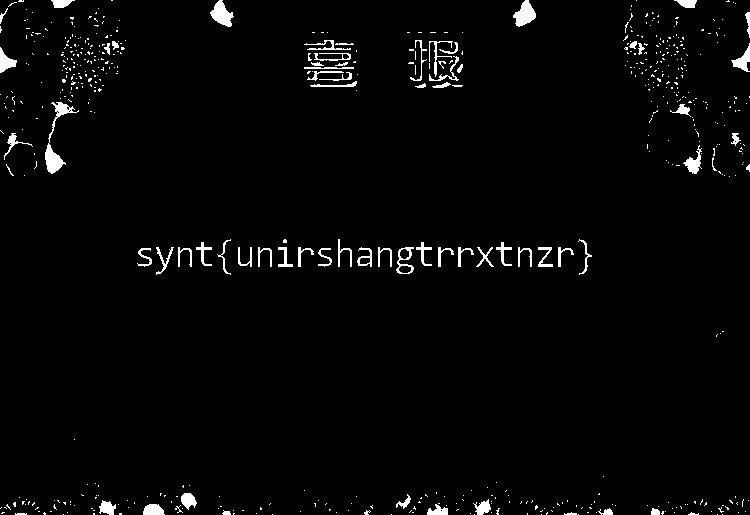
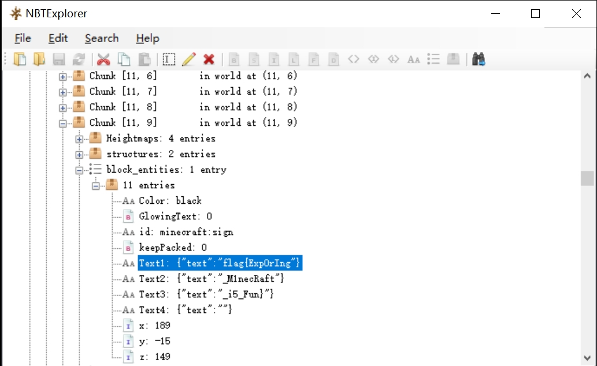
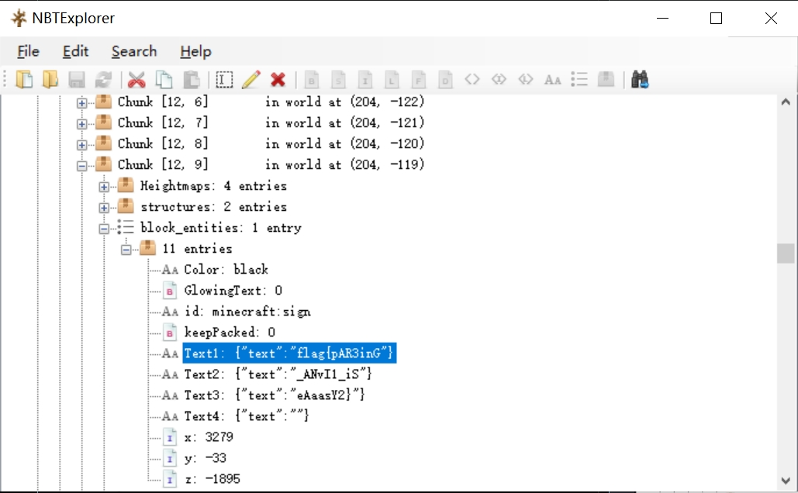
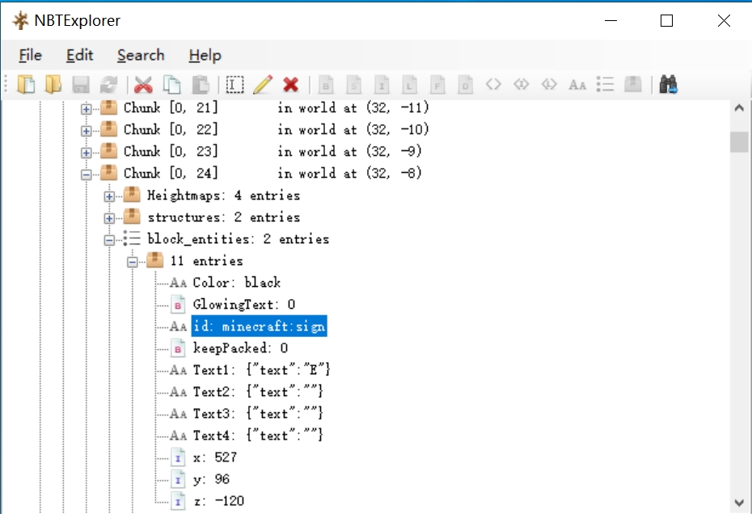
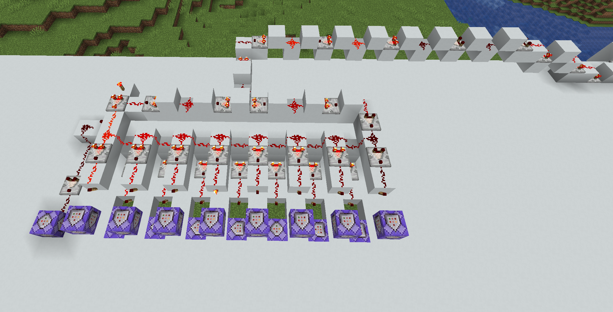
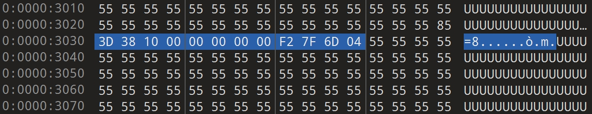
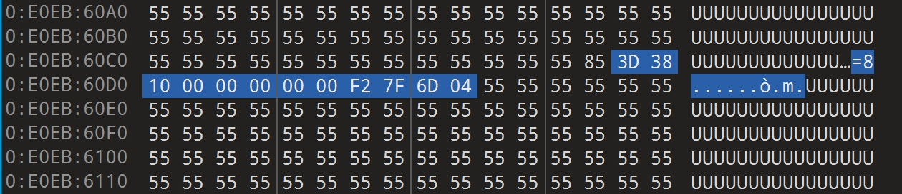
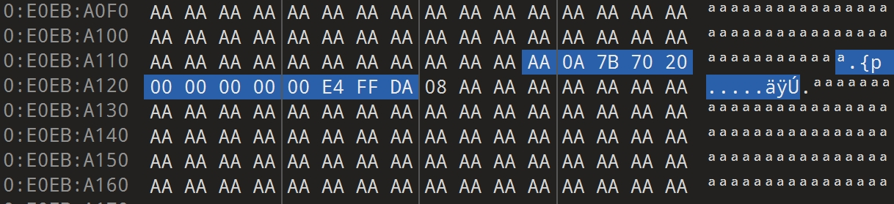
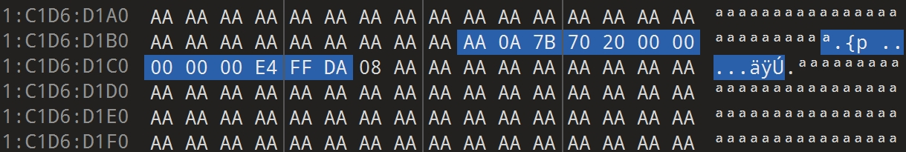
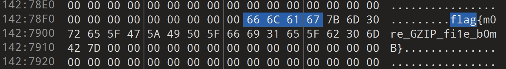

<h1> PKU GeekGame 3rd Writeup </h1>

<h2> Tutorial </h2>

<details>

<h3> 一眼盯帧 </h3>

<details>

<summary>
    <b>flag</b>
</summary>

读一下gif文件，把各帧加起来
```python
from PIL import Image, ImageSequence
import cv2
import numpy as np

fs = []

with Image.open('prob23-signin.gif') as im:
    for i, frame in enumerate(ImageSequence.Iterator(im)):
        frame = np.array(frame)[..., 0]
        frame[frame <= 180] = 0
        frame[frame > 180] = 255
        fs.append(255 - frame)

res = np.array(fs[1:])
res = np.clip(res.sum(axis=0), 0, 255).astype(np.uint8)
cv2.imwrite('res.jpg', res)
```
得到图片



看起来像凯撒密码
```python
s = 'synt{unirshangtrrxtnzr}'
def decode(ch, bias):
    if ch in '{}':
        return ch
    flag = 26 * (ord(ch) < (ord('a') + bias))
    return chr(ord(ch) + flag - bias)

for i in range(-26, 15):
    res = ''.join([decode(ch, i) for ch in s])
    if res.startswith('flag'):
        print(res)
```
得到答案
```
flag{havefunatgeekgame}
```

</details>

<h3> 小北问答!!!!! </h3>

<details>

<summary>
    <b>flag 1 & flag 2</b>
</summary>

|Question |Answer | Evidence|
|:-|:-|:-|
|1. 在北京大学（校级）高性能计算平台中，什么命令可以提交一个非交互式任务？|`sbatch`|https://hpc.pku.edu.cn/docs/pdf/ksrm.pdf|
|2. 根据 GPL 许可证的要求，基于 Linux 二次开发的操作系统内核必须开源。例如小米公司开源了 Redmi K60 Ultra 手机的内核。其内核版本号是？|`5.15.78`|First 3 lines of https://github.com/MiCode/Xiaomi_Kernel_OpenSource/blob/corot-t-oss/Makefile|
|3. 每款苹果产品都有一个内部的识别名称（Identifier），例如初代 iPhone 是 iPhone1,1。那么 Apple Watch Series 8（蜂窝版本，41mm 尺寸）是什么？|`Watch6,16`|https://gist.github.com/adamawolf/3048717|
|4. 本届 PKU GeekGame 的比赛平台会禁止选手昵称中包含某些特殊字符。截止到 2023 年 10 月 1 日，共禁止了多少个字符？（提示：本题答案与 Python 版本有关，以平台实际运行情况为准）|`4445`|Line 54-68 of https://github.com/PKU-GeekGame/gs-backend/blob/fbee2a91787c9e205451a9fe7da29e5aa73c5e4c/src/store/user_profile_store.py#L71|
|5. 在 2011 年 1 月，Bilibili 游戏区下共有哪些子分区？（按网站显示顺序，以半角逗号分隔）|`游戏视频,游戏攻略·解说,Mugen,flash游戏`|https://web.archive.org/web/20110102140319/http://bilibili.us/video/game.html|
|6. [这个照片](https://prob18.geekgame.pku.edu.cn/static/osint-challenge.jpg)中出现了一个大型建筑物，它的官方网站的域名是什么？（照片中部分信息已被有意遮挡）|`philharmonie.lu`|See below|

<h4> Q4 </h4>

```python
from unicategories import categories
from typing import Set
def unicode_chars(*cats: str) -> Set[str]:
    ret = set()
    for cat in cats:
        ret |= set(categories[cat].characters())
    return ret

EMOJI_CHARS = (
    {chr(0x200d)}  # zwj
    | {chr(0x200b)}  # zwsp, to break emoji componenets into independent chars
    | {chr(0x20e3)} # keycap
    | {chr(c) for c in range(0xfe00, 0xfe0f+1)} # variation selector
    | {chr(c) for c in range(0xe0020, 0xe007f+1)} # tag
    | {chr(c) for c in range(0x1f1e6, 0x1f1ff+1)} # regional indicator
)
DISALLOWED_CHARS = (
    unicode_chars('Cc', 'Cf', 'Cs', 'Mc', 'Me', 'Mn', 'Zl', 'Zp') # control and modifier chars
        |{chr(c) for c in range(0x12423, 0x12431+1)} # too long
        |{chr(0x0d78)} # too long
    ) - EMOJI_CHARS
print(len(DISALLOWED_CHARS))
```
由于`README`里提到安装`Python>=3.8`，盲猜实际运行环境为`Python=3.8`


<h4> Q6 </h4>

用Google搜裁剪后的图得到答案为卢森堡音乐厅


同时由赞助商信息可以搜到活动为IASP，上一届在卢森堡举行，说明答案大概率是对的

</details>

</details>

<h2> Misc </h2>

<details>

<h3> Z公司的服务器 </h3>

<details>

<summary>
    <b>flag 1</b>
</summary>

打开终端看到`*B00000000000000`，搜索发现这是`rz`命令报错的结果，结合题目里提到的<b>有一种古老的方法</b>，搜关键词`ssh rz`，时间定在2013-2014年，发现需要使用支持ZModem的telnet/ssh客户端，比如[SecureCRT](https://www.vandyke.com/products/securecrt/)，把connection protocal设置为raw连接终端，按照[此文](https://blog.csdn.net/shaochenshuo/article/details/26398445)操作即可得到flag

</details>

<h3> 基本功 </h3>

<details>

<summary>
    <b>flag 1</b>
</summary>

查看两个压缩包，里面的文件压缩方法均为`Store`，加密算法均为`ZipCrypto`，可以用[bkcrack](https://github.com/kimci86/bkcrack)破解

Google搜素`chromedriver_linux64 5.57MB`可以查到相应版本号`89.0.4389.23`，下载[这个文件](https://chromedriver.storage.googleapis.com/index.html?path=89.0.4389.23/)，安排文件如下
```
│  challenge_1.zip
│  challenge_2.zip
│  chromedriver_linux64.zip 
│
└─bkcrack-1.5.0-win64
    │  bkcrack.exe
    │  ...
```
运行以下命令
```bash
bkcrack-1.5.0-win64\bkcrack.exe -C challenge_1.zip -c chromedriver_linux64.zip -p chromedriver_linux64.zip
bkcrack-1.5.0-win64\bkcrack.exe -C challenge_1.zip -k a7663027 e40b963d 0dcb4cc4 -U challenge_1_new.zip easy
```
即可得到一个解压密码为`easy`的`challenge_1_new.zip`文件，解压可得flag。

</details>

<details>

<summary>
    <b>flag 2</b>
</summary>

把`pcapng`格式的header可以确定得有第8-11字节`4D3C2B1A`（小端模式）和第16-23字节`FFFFFFFFFFFFFFFF`，故用以下命令
```bash
bkcrack-1.5.0-win64\bkcrack.exe -C challenge_2.zip -c flag2.pcapng -x 8 4D3C2B1A -x 16 FFFFFFFFFFFFFFFF
bkcrack-1.5.0-win64\bkcrack.exe -C challenge_2.zip -k cf6943b2 e9343f70 30ab24f7 -U challenge_2_new.zip easy
```
即可得到一个解压密码为`easy`的`challenge_2_new.zip`文件

用[Wireshark](https://www.wireshark.org/download.html)打开，`文件->打出对象->HTTP`即可直接得到flag2

</details>

<h3> Dark Room </h3>

<details>

<summary>
    <b>flag 1</b>
</summary>

徒手玩几轮得到地图
```
#############################################################
             Outside (Get Flag 1 if >= 117% san)
#############################################################
#         #         #         #         #.........#.........#
#   Gold  # Hallway # Hallway #  Brass  #.........#.........#
#   Door  #         #         #   Key   #.........#.........#
#         #         #         #         #.........#.........#
#############################################################
#         #.........#         #.........#.........#.........#
#  Flag2  #.........# Hallway #.........#.........#.........#
#   Room  #.........#         #.........#.........#.........#
#         #.........#         #.........#.........#.........#
#############################################################
#.........#.........#         #         #         #         #
#.........#.........# *Start* # Hallway # Hallway # Trinket #
#.........#.........#         #         #         #   Room  #
#.........#.........#         #         #         #         #
#############################################################
#.........#         #.........#.........#         #.........#
#.........#   Gold  #.........#.........#  Brass  #.........#
#.........#   Key   #.........#.........#   Door  #.........#
#.........#         #.........#.........#         #.........#
#############################################################
#.........#         #         #         #         #.........#
#.........# Hallway # Hallway # Hallway # Hallway #.........#
#.........#         #         #         #         #.........#
#.........#         #         #         #         #.........#
#############################################################
#.........#         #.........#.........#         #.........#
#.........#  Spider #.........#.........#  Latte  #.........#
#.........#   Room  #.........#.........#   Room  #.........#
#.........#         #.........#.........#         #.........#
#############################################################
```
输入`h`时有1/10的概率加9点san值，9/10的概率降san值，得到flag 1的要求是以`>=117%`的san值通关，而不输入`h`无邪道通关的最多san值为`90%`，故只需在开始时连续三次输入`h`均增加san值，然后按正常流程过关即可

题目要求3s连一次，连续三次都加san值的概率1/1000，没事儿的时候挂着[这玩意儿](./resources/Dark%20Room/flag1.py)刷flag即可

</details>

<details>

<summary>
    <b>flag 2</b>
</summary>

进入`Flag Room`，可以输入的指令多了一条`getflag`，要求猜测`public key`，当我们输入非数字时会得到以下结果
```
Guess my public key (give me a number): un89q
invalid literal for int() with base 10: 'un89q'
Traceback (most recent call last):
    File "dark_room/player.py", line 249, in <module>
    248:   while flag_number:
    249:      choice = int(self.recv(b"Guess my public key (give me a number): ").decode())
                    ^^^^^^^^^^^^^^^^^^^^^^^^^^^^^^^^^^^^^^^^^^^^^^^^^^^^^^^^^^^^^^^^^^^^
    250:      if flag_number & 1:
    251:          p = getStrongPrime(2048)
    252:          q = getStrongPrime(2048)
    253:      flag_number >> 1
ValueError: invalid literal for int() with base 10: 'un89q'
```
`getStrongPrime`是一个耗时很长的函数，所以可以通过发送与接受的时间差得到`flag_number`的二进制表示，参考[程序](./resources/Dark%20Room/flag2/flag2.py) ，每八位用ASCII编码即得flag

</details>

<h3> 麦恩·库拉夫特 </h3>

<details>

<summary>
    <b>flag 1 & flag 2</b>
</summary>

用[NBTExplorer](https://github.com/jaquadro/NBTExplorer/releases)打开存档文件夹，搜关键词`flag{`即可

显然，这是非预期解（





</details>

<details>

<summary>
    <b>flag 3</b>
</summary>

注意到前两个flag都写在告示牌上，盲猜与第三个flag有关的提示也会写在告示牌上，搜关键词`minecraft:sign`，可以发现



进游戏`/tp @p 527 96 -120`看到一个诡异的机器，研究一下显示器的输入部分，发现有坏蛋乱摆红石中继器，导致显示对于个别输入值，显示器响应时间会慢1个redstone tick，所以我们先调中继器档位使得机器对各个值的响应时间一致，然后 <del>维修一下</del>直接拆掉显示部分，改用命令方块告诉我们数字



自右向左分别为`/say 0`到`/say F`，然后...磁带输入，启动！

最后的任务就是进行[5fps超高帧率录屏](./resources/麦恩·库拉夫特/flag3/flag3_video.mkv)，并[盯帧](./resources/麦恩·库拉夫特/flag3/flag3_video2hex.ipynb)得到十六进制的[字符串文件](./resources/麦恩·库拉夫特/flag3/flag3_hexres)，转成PNG得到


</details>

</details>

<h2> Web </h2>

<details>

<h3> Emoji Wordle </h3>

<details>

<summary>
    <b> flag 1 </b>
</summary>

[这个地方](https://unicode.org/Public/emoji/15.1/emoji-test.txt)可以查到所有的emoji，此外由于flag 1的答案是固定的，所以相当于可以试无数次

一个可以尝试无数次且输入范围给定了的wordle破解起来不过是[无脑体力活](./resources/Emoji%20Wordle/processing-flag1.ipynb)罢了

</details>

<details>

<summary>
    <b> flag 2 </b>
</summary>

进入网页查看cookie，发现Name为`PLAY_SESSION`对应的值很有意思
```
eyJhbGciOiJIUzI1NiJ9.eyJkYXRhIjp7ImxldmVsIjoiMiIsInJlbWFpbmluZ19ndWVzc2VzIjoiOCIsInRhcmdldCI6Ilx1RDgzRFx1REM3OVx1RDgzRFx1REM3RVx1RDgzRFx1REM4NVx1RDgzRFx1REM4Nlx1RDgzRFx1REM2NFx1RDgzRFx1REM0N1x1RDgzRFx1REM3Q1x1RDgzRFx1REM0N1x1RDgzRFx1REM1Qlx1RDgzRFx1REM0Nlx1RDgzRFx1REM0N1x1RDgzRFx1REM1NFx1RDgzRFx1REM1QVx1RDgzRFx1REM1RFx1RDgzRFx1REM4N1x1RDgzRFx1REM1RVx1RDgzRFx1REM1N1x1RDgzRFx1REM2MFx1RDgzRFx1REM0NVx1RDgzRFx1REM4QVx1RDgzRFx1REM1MVx1RDgzRFx1REM3RFx1RDgzRFx1REM0NFx1RDgzRFx1REM1N1x1RDgzRFx1REM4QVx1RDgzRFx1REM3N1x1RDgzRFx1REM0Mlx1RDgzRFx1REM2MVx1RDgzRFx1REM4M1x1RDgzRFx1REM2MFx1RDgzRFx1REM4NFx1RDgzRFx1REM4Mlx1RDgzRFx1REM3NVx1RDgzRFx1REM4NFx1RDgzRFx1REM2MFx1RDgzRFx1REM3Nlx1RDgzRFx1REM2NVx1RDgzRFx1REM0N1x1RDgzRFx1REM1OVx1RDgzRFx1REM2NFx1RDgzRFx1REM2N1x1RDgzRFx1REM1NFx1RDgzRFx1REM2Mlx1RDgzRFx1REM1OVx1RDgzRFx1REM0M1x1RDgzRFx1REM1MVx1RDgzRFx1REM0N1x1RDgzRFx1REM1NFx1RDgzRFx1REM3QVx1RDgzRFx1REM4MVx1RDgzRFx1REM3OVx1RDgzRFx1REM3OVx1RDgzRFx1REM1NFx1RDgzRFx1REM4MVx1RDgzRFx1REM2MVx1RDgzRFx1REMzRlx1RDgzRFx1REM1Q1x1RDgzRFx1REM4NVx1RDgzRFx1REM3Mlx1RDgzRFx1REM2QVx1RDgzRFx1REM3RFx1RDgzRFx1REM4Nlx1RDgzRFx1REM1Q1x1RDgzRFx1REM1QSJ9LCJuYmYiOjE2OTc2MjQ5NzYsImlhdCI6MTY5NzYyNDk3Nn0.Rt693w7sxTkvPYsjeUkJtEFZjFhj5xRYoUmVZYYr-FI
```
直接用搜索引擎查这个字符串容易发现这是`JWT`数据结构，中间那部分用BASE64解码后所得的`target`字段内的值
```
\uD83D\uDC79\uD83D\uDC7E\uD83D\uDC85\uD83D\uDC86\uD83D\uDC64\uD83D\uDC47\uD83D\uDC7C\uD83D\uDC47\uD83D\uDC5B\uD83D\uDC46\uD83D\uDC47\uD83D\uDC54\uD83D\uDC5A\uD83D\uDC5D\uD83D\uDC87\uD83D\uDC5E\uD83D\uDC57\uD83D\uDC60\uD83D\uDC45\uD83D\uDC8A\uD83D\uDC51\uD83D\uDC7D\uD83D\uDC44\uD83D\uDC57\uD83D\uDC8A\uD83D\uDC77\uD83D\uDC42\uD83D\uDC61\uD83D\uDC83\uD83D\uDC60\uD83D\uDC84\uD83D\uDC82\uD83D\uDC75\uD83D\uDC84\uD83D\uDC60\uD83D\uDC76\uD83D\uDC65\uD83D\uDC47\uD83D\uDC59\uD83D\uDC64\uD83D\uDC67\uD83D\uDC54\uD83D\uDC62\uD83D\uDC59\uD83D\uDC43\uD83D\uDC51\uD83D\uDC47\uD83D\uDC54\uD83D\uDC7A\uD83D\uDC81\uD83D\uDC79\uD83D\uDC79\uD83D\uDC54\uD83D\uDC81\uD83D\uDC61\uD83D\uDC3F\uD83D\uDC5C\uD83D\uDC85\uD83D\uDC72\uD83D\uDC6A\uD83D\uDC7D\uD83D\uDC86\uD83D\uDC5C\uD83D\uDC5A
```
是emoji的UTF-16编码形式

</details>

</details>

<h2> Binary </h2>

<details>

<h3> 汉化绿色版免费下载 </h3>

<details>

<summary>
    <b>flag 1</b>
</summary>


用[xp3viewer](https://github.com/yangg1g/unpacktools/tree/master/XP3Viewer)解包`data.xp3`文件，在`scenario/done.ks`里可以找到flag 1

</details>

<details>

<summary>
    <b>flag 2</b>
</summary>

用[KirikiriDescrambler](https://github.com/arcusmaximus/KirikiriTools/releases)解包`savedata/data0.kdt`文件和`savedata/datasu.ksd`文件

读解包`data.xp3`文件后得到的`scenario/round1`和`scenario/round2`，可以知道程序判断两次输入的flag是否相等的依据为判断其hash值是否相等，对于输入序列$a_1a_2...a_n$，hash的计算方法为
```python
h = 1337
dic = {'A': 11, 'E': 22, 'I': 33, 'O': 44, 'U': 55, '}': 66}
for i in range(1, n+1):
    h = h * 13337 + dic[a[i]]
h = h % 19260817
```

读解包的`savedata/data0.kdt`的最后几行，可以得知需要使得hash最终的值为7748521

读解包的`savedata/datasu.ksd`，可以发现属性`trail_round1_sel_*`存的是第一次输入flag中字母`*`的个数，即flag中有1个`i`、3个`e`、6个`o`、6个`a`，情况总数足够少，可以[暴力枚举](resources/汉化绿色版免费下载/flag2.ipynb)解决

</details>

<h3> 初学C语言 </h3>

<details>

<summary>
    <b>flag 1 [放出提示后解出]</b>
</summary>

反汇编`test`函数分析栈帧
```
-0x000(%rbp)    |----<test> stack starts here----|
                |            %fs:0x28            |
-0x008(%rbp)    |--------------------------------|
                |                                | 
-0x010(%rbp)    |--------------------------------|
                |                                |
                |                                |
                |           input buf            |
                |                                |
                |                                |
-0x410(%rbp)    |--------------------------------|
                |                                |
                |             flag 1             |
                |                                |
-0x450(%rbp)    |--------------------------------|
                |                                |
                |       "a_public_string"        |
                |                                |
-0x490(%rbp)    |--------------------------------|
                |                                |
                |     "a_very_secret_string"     |
                |                                |
-0x4d0(%rbp)    |--------------------------------|
                |              *fp               |
-0x4d8(%rbp)    |--------------------------------|
                |           0xdeadbeef           |
-0x4e0(%rbp)    |--------------------------------|
                |            1919810             |
-0x4e4(%rbp)    |--------------------------------|
                |             114514             |
-0x4e8(%rbp)    |--------------------------------|
                |                                | 
-0x4f0(%rbp)    |-----<test> stack ends here-----|
```
尝试输入
```
%s %x %x %x %x %x %x %x %x %x %x %x %x 
```
得到
```
a_public_string deadbeef 41add590 41add610 0 0 1bf52 deadbeef 56a94b70 65765f61 65726365 676e6972 0 
```
第二个`deadbeaf`是`test`函数栈帧里存储的值，因此只需输入
```
%s%x%x%x%x%x%x%x%x%x%x%x%x%x%x%x%x%x%x%x%x%x%x%x%x [%016llx%016llx%016llx%016llx]
```
返回结果中处在`[]`中的值就是flag的十六进制表示，[解码](resources/初学C语言/flag1.py)即可得flag

</details>

</details>

<h2> Algorithm </h2>

<details>

<h3> 关键词过滤喵，谢谢喵 </h3>

<details>

<summary>
    <b>flag 1 喵</b>
</summary>

只要把所有字符转换成`a`喵，然后数`a`的个数喵，那么只要把连续的一千个`a`换成`d`喵，连续一百个`a`换成`c`喵，连续十个`a`换成`b`喵，然后把`a{9}, b{9}, c{9}, d{9}`都转换成`9`喵，……，把`a{1}, b{1}, c{1}, d{1}`都转换成`1`喵，在转换之前特判一些补零的地方即可喵，具体参见[喵](resources/关键词过滤喵，谢谢喵/flag1/flag1.txt)，谢谢喵

</details>

<details>

<summary>
    <b>flag 2 喵</b>
</summary>

从题目中知道喵，输入的不含emoji喵，所以对每一行喵，用形如`re.compile(r'(...)').sub(r'\1😇\1')`的指令复制一遍喵，中间用emoji分割喵，再把emoji之后的内容用flag 1的方法转换成长度喵，每一行的内容就变成`content😇length`了喵

下面进行排序喵，理论上可以直接用冒泡排序喵，但是笨蛋并不会用正则表达式比较任意两个数字的大小喵，笨蛋有笨蛋自己的方法喵，因为0-9的排序可以用9行暴力写出来喵，所以可以用基数排序喵
- 先按照长度的位数从小到大排序喵，先用`🧡💛💚💙💜`分别表示1-5位数喵，举个例子就是把`meowmeow😇128`变成`meowmeow😇💚128`喵，然后就可以很暴力地写出按位数排序的方法
- 然后对每一个位数下的所有数据的个位分别排序喵，排完序之后去掉个位喵，去掉个位之后再按照新的个位排序喵，这个过程重复五次基数排序就完成了喵，很开心喵

程序参见[喵喵](resources/关键词过滤喵，谢谢喵/flag2/flag2.txt)，写得很暴力喵，不要嘲笑喵，谢谢喵

</details>

<h3> 未来磁盘 </h3>

<details>

<summary>
    <b>flag 1 [放出提示后解出]</b>
</summary>

解压两次得到一个7GB左右的文件，用010 Editor打开后找周期性pattern（指用肉眼观察然后把感觉特殊的地方全文检索一遍）

可以找到前半部分重复次数很多的周期性pattern为





把这中间的东西全删掉

后半部分重复次数很多的周期性pattern为





把这中间的东西也全删掉，保存后得到一个大小40KB左右的文件，无视CRC校验错误把它解压后打开即可找到flag



flag 2解压两遍的文件40G，电脑带不动，遂放弃（

</details>

<h3> 小章鱼的曲奇 </h3>

<details>

<summary>
    <b>flag 1</b>
</summary>

`MT19937Predictor`需要624个已知的顺序32位数来预测接下来的随机数，而我们恰好有625个，世上怎么会有这么巧的事🥰

所以只需要用`MT19937Predictor`预测随机数再与原来的数字做异或即可[[代码]](resources/小章鱼的曲奇/flag1/flag1.ipynb)（写得依托DB，原因是我对Python中`bytes`、`str`、`int(hex)`的转换与处理手法的理解遥遥领先）

</details>

<details>

<summary>
    <b>flag 2</b>
</summary>

用跟flag 1一模一样的代码就直接跑出来了（虽然不知道为什么，但是`MT19937Predictor`牛逼就对了）

</details>

<details>

<summary>
    <b>flag 3 [放出提示后解出]</b>
</summary>

非预期解就是输出的第一个数，出题人不慎少判断的条件是输入的数字个数与`rounds_of_curses`的对比

🙁这么简单的解怎么放提示前没发现呢🙁

</details>

<h3> 华维码 </h3>

<details>

<summary>
    <b>flag 1</b>
</summary>

先把25个小块都[切出来](./resources/华维码/flag1/hard.py)，再根据[二维码编码规则](https://blog.csdn.net/search_129_hr/article/details/120796256)在PPT里手工拼出[半成品](resources/华维码/flag1/flag1_part.png)，剩余的块交给[暴力枚举](resources/华维码/flag1/hard-decode.ipynb)即可

</details>

</details>
